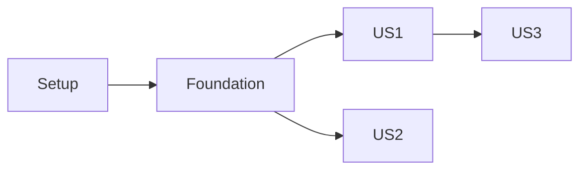

# Spec-Kit Tasks

Generate actionable, dependency-ordered tasks from design artifacts. This is the **third step** in spec-kit workflow.

## When to Use

- After creating plan.md with `spec-kit-plan`
- Ready to break down implementation into tasks
- Need to estimate and organize work
- User asks "what needs to be done?"

## What It Does

Creates tasks.md with:

1. **Dependency-ordered tasks** organized by user story
2. **Parallel execution opportunities** marked with [P]
3. **Independent test criteria** for each story
4. **File paths** for each task
5. **Task IDs** for tracking (T001, T002, etc.)

## Prerequisites

- plan.md must exist (created by `spec-kit-plan`)
- spec.md should exist (created by `spec-kit-specify`)
- Run from repository root

## Basic Usage

### Step 1: Load Design Artifacts

Run prerequisites check:

```bash
.specify/scripts/bash/check-prerequisites.sh --json
```

Reads from FEATURE_DIR:

- **Required**: plan.md, spec.md
- **Optional**: data-model.md, contracts/, research.md

### Step 2: Generate Tasks

Creates tasks.md organized by:

- Phase 1: Setup (project initialization)
- Phase 2: Foundational (blocking prerequisites)
- Phase 3+: User Stories (one phase per story, priority order)
- Final Phase: Polish & cross-cutting concerns

### Step 3: Validate Tasks

Ensures:

- Each user story has complete tasks
- Tasks are independently testable
- Dependencies are clear
- File paths are specific

## Output Format

### tasks.md Structure

````markdown
# Tasks: [Feature Name]

## Implementation Strategy

**Approach:** MVP-first, incremental delivery

- Phase 3 (US1) is MVP
- Phases 4-6 are incremental additions
- Each phase is independently testable

## Dependencies


````

## Phase 1: Setup

- [ ] T001 Create project structure per plan.md
- [ ] T002 [P] Install dependencies: bcrypt, jsonwebtoken
- [ ] T003 [P] Configure TypeScript for auth module

## Phase 2: Foundational

- [ ] T004 Create User model in src/models/user.ts
- [ ] T005 [P] Create database migration for users table
- [ ] T006 [P] Set up JWT utility in src/utils/jwt.ts

## Phase 3: User Story 1 - User Registration

**Story Goal:** Users can register with email/password

**Independent Test:** Create account, verify in database, receive JWT

### Implementation Tasks

- [ ] T007 [P] [US1] Create registration endpoint POST /api/auth/register
- [ ] T008 [P] [US1] Implement email validation in src/utils/validation.ts
- [ ] T009 [US1] Hash password with bcrypt in registration handler
- [ ] T010 [US1] Generate JWT token after registration
- [ ] T011 [P] [US1] Create registration form component

### Tests

- [ ] T012 [P] [US1] Unit test: Email validation
- [ ] T013 [P] [US1] Unit test: Password hashing
- [ ] T014 [US1] Integration test: Registration flow

## Phase 4: User Story 2 - User Login

[Similar structure...]

## Parallel Execution Examples

**Phase 3 (US1) - Can run in parallel:**

- T007, T008 (different files, no dependencies)
- T012, T013 (independent tests)

**Cannot parallelize:**

- T009 → T010 (T010 depends on T009 completion)

```

## Task Format Requirements

Every task MUST follow:
```

- [ ] [TaskID] [P?] [Story?] Description with file path

```

**Components:**
1. **Checkbox**: `- [ ]`
2. **Task ID**: Sequential (T001, T002...)
3. **[P] marker**: Only if parallelizable
4. **[Story] label**: Required for story phase tasks ([US1], [US2], etc.)
5. **Description**: Clear action + exact file path

**Examples:**
- ✅ `- [ ] T001 Create project structure per plan.md`
- ✅ `- [ ] T005 [P] Implement User model in src/models/user.ts`
- ✅ `- [ ] T012 [P] [US1] Create registration endpoint in src/api/auth.ts`
- ❌ `- [ ] Create User model` (missing ID and path)
- ❌ `T001 [US1] Create model` (missing checkbox)

## Task Organization

### From User Stories (spec.md)
- Each user story (P1, P2, P3) gets own phase
- Map components to their story:
  - Models needed
  - Services needed
  - Endpoints/UI needed
  - Tests (if requested)

### From Design Artifacts
- **Data Model** → Entity creation tasks
- **Contracts** → API endpoint tasks
- **Plan.md** → Infrastructure tasks

## Best Practices

✅ **DO:**
- Break into small, focused tasks
- Include specific file paths
- Mark parallelizable tasks with [P]
- Organize by user story
- Make each phase independently testable

❌ **DON'T:**
- Create tasks too large (> 1 day)
- Skip file paths
- Make circular dependencies
- Mix multiple stories in one task
- Forget test tasks (if requested)

## Example Workflow

```

Input: plan.md with auth design, spec.md with 3 user stories

Task Generation:

1. Setup Phase:
   - T001: Project structure
   - T002-T003: Dependencies

2. Foundation Phase:
   - T004-T006: Core models and utils

3. US1 Phase (Registration):
   - T007-T011: Implementation
   - T012-T014: Tests

4. US2 Phase (Login):
   - T015-T019: Implementation
   - T020-T022: Tests

5. US3 Phase (Password Reset):
   - T023-T027: Implementation
   - T028-T030: Tests

Output: tasks.md with 30 dependency-ordered tasks

```

## Dependency Management

### Identify Dependencies
- **Setup** → **Foundation** (always)
- **Foundation** → **User Stories** (blocking)
- **Story dependencies** (if any)

### Mark Parallelization
- Different files + no dependencies = [P]
- Tests for same story = [P]
- Same file or dependent logic = sequential

## Next Steps

After creating tasks.md:
- **Analyze** for consistency with `spec-kit-analyze`
- **Start implementation** with `spec-kit-implement`
- **Convert to issues** with spec-kit-taskstoissues (optional)

## Related Skills

- **spec-kit-plan** - Creates plan.md (prerequisite)
- **spec-kit-implement** - Executes tasks (next step)
- **spec-kit-analyze** - Validates consistency
- **spec-kit-checklist** - Generates custom checklists

## Common Issues

**Missing plan.md:**
```

Run spec-kit-plan first to create implementation plan

```

**Tasks too vague:**
```

Include specific file paths and clear actions

```

**Too many tasks:**
```

Each user story should have 5-15 tasks typically
Break large stories into smaller ones

```

## Tips for Good Task Lists

1. **Granular**: Each task is 2-8 hours of work
2. **Specific**: Include exact file paths
3. **Testable**: Clear completion criteria
4. **Ordered**: Respect dependencies
5. **Independent**: Each story can be implemented separately

---

**Remember**: Good tasks make implementation smooth. After tasks, use `spec-kit-implement` to execute them.
```
