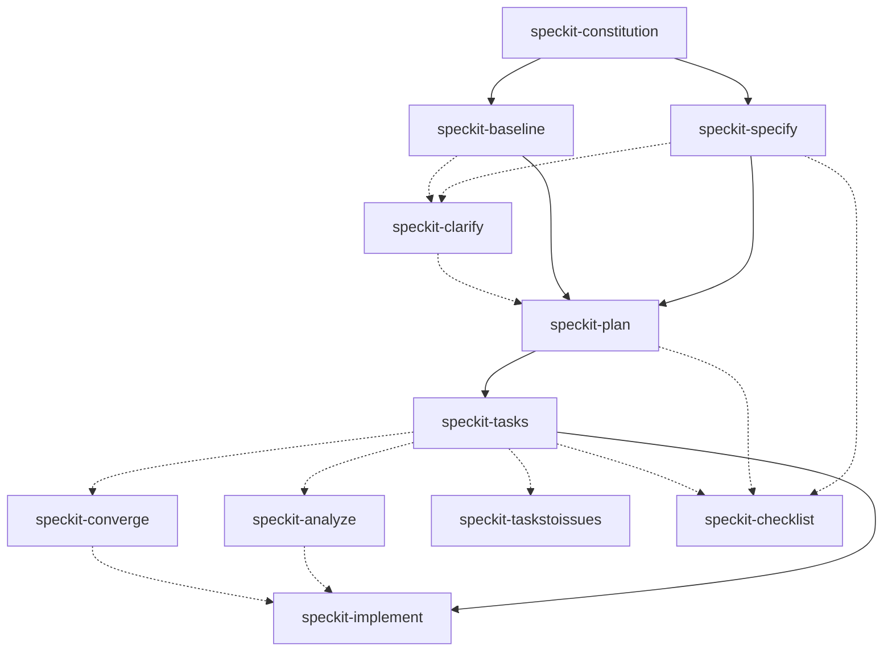

# speckit-agent-skills

Agent skills and generated runtime entry points for [Spec Kit](https://github.com/github/spec-kit).

## Overview

This repository tracks the current Spec Kit output together with a small set of repository-specific skills.

- **Shared Agent Skills** - `skills/` contains the shared `speckit-*` skills plus repository-specific skills. Claude Code uses them through `.claude/skills`, while Codex CLI uses them through `.agents/skills`.
- **Cursor Agent** - Spec Kit-generated skills live in `.cursor/skills/`.
- **GitHub Copilot CLI** - Spec Kit-generated agents and prompt wrappers live in `.github/agents/` and `.github/prompts/`.
- **OpenCode** - Spec Kit-generated commands live in `.opencode/commands/`.
- **Gemini CLI** - `.gemini/commands/` remains checked in, but Gemini is not part of the current CI regeneration set.
- **Spec Kit infrastructure** - `.specify/` contains integration state, manifests, scripts, and templates used by the generated skills and commands.

The tracked Spec Kit version is recorded in [VERSION.md](./VERSION.md). CI checks the latest Spec Kit release and regenerates outputs only when that version changes.

## Current integration model

The repository CI currently runs `specify init --integration` for:

- `codex`
- `agy`
- `cursor-agent`
- `copilot`
- `opencode`
- `claude`

The generated files are therefore not all stored in the same layout:

| Runtime / integration | Repository path                       | Role                                                                 |
| --------------------- | ------------------------------------- | -------------------------------------------------------------------- |
| Agent Skills (`agy`)  | `skills/`                             | Shared Spec Kit skills                                               |
| Claude Code           | `.claude/skills -> ../skills`         | Shared skills exposed to Claude Code                                 |
| Codex CLI             | `.agents/skills -> ../skills`         | Shared skills exposed to Codex                                       |
| Cursor Agent          | `.cursor/skills/`                     | Cursor-specific generated skill copies                               |
| GitHub Copilot CLI    | `.github/agents/`, `.github/prompts/` | Generated agents and prompt wrappers                                 |
| OpenCode              | `.opencode/commands/`                 | Generated commands                                                   |
| Gemini CLI            | `.gemini/commands/`                   | Checked-in commands; not regenerated by the current CI configuration |

Legacy layouts such as `.claude/commands/`, `.codex/prompts/`, and `.opencode/command/` are intentionally not maintained.

## Quickstart

1. Clone this repository.

   ```bash
   git clone https://github.com/dceoy/speckit-agent-skills.git
   cd speckit-agent-skills
   ```

2. Install [Spec Kit](https://github.com/github/spec-kit).

3. Initialize a target project with the Spec Kit integration appropriate for your agent.

   ```bash
   specify init --here --integration <integration>
   ```

4. If the target runtime consumes Agent Skills directly, copy the required skills from `skills/` into that project's skills directory when needed.

   ```bash
   cp -a skills/* /path/to/project/skills/
   ```

5. Invoke the relevant `speckit-*` skill or runtime command from your agent.

## Spec Kit workflow

The main Spec-Driven Development flow in this repository is:

1. **Constitution** - Define project principles.
2. **Specify** - Capture requirements for new work.
   - Or **Baseline** - Derive a specification from an existing codebase.
3. **Clarify** _(optional)_ - Resolve material ambiguities.
4. **Plan** - Produce the implementation strategy.
5. **Tasks** - Generate ordered work items.
6. **Analyze** _(optional)_ - Check consistency across the specification, plan, and tasks.
7. **Converge** _(optional)_ - Compare an existing implementation with the spec/plan/tasks and append remaining work to `tasks.md`.
8. **Implement** - Execute the tasks.

Additional utilities include **Checklist** for requirements-quality checks and **Tasks to Issues** for converting generated tasks into GitHub issues.

See [AGENTS.md](./AGENTS.md#spec-kit-workflow) for repository guidance.

### Visual workflow



## Skills

### Spec Kit skills

The current shared `speckit-*` set includes:

- `speckit-analyze`
- `speckit-baseline`
- `speckit-checklist`
- `speckit-clarify`
- `speckit-constitution`
- `speckit-converge`
- `speckit-implement`
- `speckit-plan`
- `speckit-specify`
- `speckit-tasks`
- `speckit-taskstoissues`

Most Spec Kit-managed skills are tracked by the manifests in `.specify/integrations/`. `speckit-baseline` is a repository-specific skill for deriving specifications from existing code.

### Utility skills

- `claude-command-converter` - Repository-specific utility for converting Claude command content into Agent Skill format.

## Structure

```text
.
├── skills/                      # Shared and repository-specific Agent Skills
├── .agents/
│   └── skills -> ../skills      # Codex CLI access to shared skills
├── .claude/
│   └── skills -> ../skills      # Claude Code access to shared skills
├── .cursor/
│   └── skills/                  # Cursor Agent generated skills
├── .gemini/
│   └── commands/                # Checked-in Gemini commands
├── .github/
│   ├── agents/                  # GitHub Copilot generated agents
│   ├── prompts/                 # GitHub Copilot prompt wrappers
│   └── workflows/               # CI and Spec Kit regeneration workflows
├── .opencode/
│   └── commands/                # OpenCode generated commands
├── .specify/
│   ├── integrations/            # Integration manifests
│   ├── scripts/bash/            # Spec Kit helper scripts
│   ├── templates/               # Spec Kit templates
│   ├── init-options.json        # Last initialization options
│   └── integration.json         # Current integration state
├── .vscode/
│   └── settings.json            # Workspace settings
├── AGENTS.md                    # Repository guidance
├── CLAUDE.md -> AGENTS.md       # Claude Code guidance symlink
└── VERSION.md                   # Tracked Spec Kit version
```

## Regeneration

`.github/workflows/ci.yml` calls `.github/workflows/speckit-init.yml`. The workflow:

1. resolves the latest Spec Kit release,
2. records `specify --version` in `VERSION.md`,
3. skips regeneration when `VERSION.md` is unchanged,
4. runs `specify init --force --here --ignore-agent-tools --script sh --integration` for the configured integrations,
5. formats generated Markdown and JSON, and
6. commits updated Spec Kit outputs when the tracked version changes.

Treat manifest-managed runtime files as generated output. Prefer changing the integration configuration or repository-specific skills instead of manually maintaining generated copies.

## Prerequisites

Install and authenticate only the runtime tools you intend to use, plus Spec Kit itself.

- **Claude Code** - Uses `.claude/skills`.
- **OpenAI Codex CLI** - Uses `.agents/skills`.
- **Cursor Agent** - Uses `.cursor/skills/`.
- **GitHub Copilot CLI** - Uses `.github/agents/` and `.github/prompts/`.
- **OpenCode** - Uses `.opencode/commands/`.
- **Gemini CLI** - Can use the checked-in `.gemini/commands/`, but those files are outside the current regeneration set.
- **Spec Kit** - Install from [github.com/github/spec-kit](https://github.com/github/spec-kit).

## Usage notes

- Skills do not always auto-run; use the runtime's skill invocation flow or request the skill explicitly.
- If a skill fails, inspect its `SKILL.md` and verify the required Spec Kit project structure and prerequisites.
- Run Spec Kit helper scripts from the repository root and prefer their structured output modes such as `--json` when available.
- Do not restore legacy runtime layouts unless a currently supported Spec Kit integration starts generating them again.

## Contributing

See [AGENTS.md](./AGENTS.md) for repository guidelines and validation requirements.

## License

See [LICENSE](./LICENSE) for details.
