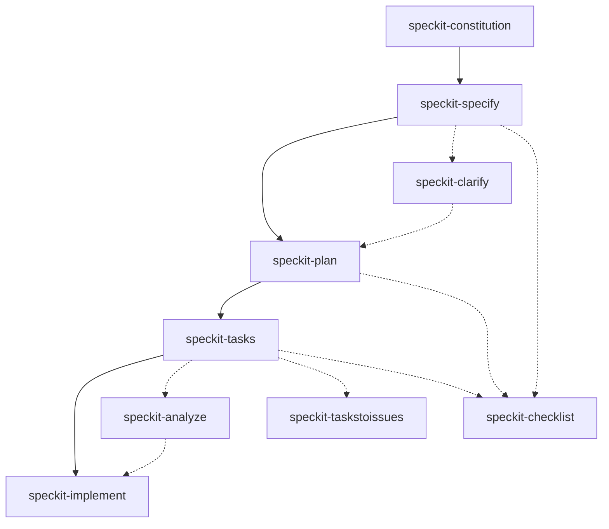

# speckit-agent-skills

Agent skills for [Spec Kit](https://github.com/github/spec-kit)

## Overview

This repository provides reusable skills and Spec Kit-generated entry points for multiple agent runtimes:

- **Shared skills** - Source skills live in `skills/` and are exposed to Claude Code through `.claude/skills` and Codex CLI through `.agents/skills`.
- **GitHub Copilot CLI** - Spec Kit agent files live in `.github/agents/` with companion prompt files in `.github/prompts/`.
- **Gemini CLI** - Spec Kit command files live in `.gemini/commands/`.
- **OpenCode** - Spec Kit command files live in `.opencode/commands/`.
- **Spec Kit** - Spec-Driven Development workflow skills (`speckit-*`) are shared across supported runtimes.

Each skill directory has a `SKILL.md` with YAML front matter that includes the skill configuration and documentation.

## Quickstart

1. Clone this repository and change into it.

   ```bash
   git clone https://github.com/dceoy/speckit-agent-skills.git
   cd speckit-agent-skills
   ```

2. Install [Spec Kit](https://github.com/github/spec-kit).

3. Create a new project or initialize an existing project using `specify init`.

4. Copy the `skills/` directory into the project's agent skills directory when the runtime does not already expose it.

   ```bash
   cp -a speckit-agent-skills/skills/* /path/to/a/project/agent/directory/skills/
   ```

5. Use the skills on your preferred agent.

### Spec Kit Workflow

This repository implements the **Spec-Driven Development** methodology via Spec Kit skills. The canonical workflow:

1. **Constitution** → Define project principles
2. **Specify** → Capture feature requirements (what/why)
   - Or **Baseline** → Generate specs from existing code
3. **Clarify** (optional) → Resolve ambiguities
4. **Plan** → Create technical strategy (how)
5. **Analyze** (optional) → Validate consistency
6. **Tasks** → Generate ordered work items
7. **Implement** → Execute development

See **[AGENTS.md](./AGENTS.md#spec-kit-workflow)** for the complete workflow guide with examples and best practices.

#### Visual workflow



## Skills by runtime

### Shared skills (`skills/`)

- `speckit-*` - Spec Kit workflow skills

### Runtime access

- **Claude Code:** `.claude/skills` (symlink to `../skills`)
- **Codex CLI:** `.agents/skills` (symlink to `../skills`)
- **GitHub Copilot CLI:** `.github/agents/` and `.github/prompts/`
- **Gemini CLI:** `.gemini/commands/`
- **OpenCode:** `.opencode/commands/`

Legacy Spec Kit command layouts such as `.claude/commands/`, `.codex/prompts/`, and `.opencode/command/` are intentionally not maintained.

## Structure

```text
.
├── skills/              # Source skills (speckit-*)
├── .agents/
│   └── skills -> ../skills
├── .claude/
│   └── skills -> ../skills
├── .gemini/
│   └── commands/        # Gemini CLI commands (speckit.*.toml)
├── .github/
│   ├── agents/          # GitHub Copilot CLI agents (speckit.*.agent.md)
│   ├── prompts/         # GitHub Copilot CLI prompt wrappers
│   └── workflows/       # CI workflows
├── .opencode/
│   └── commands/        # OpenCode commands (speckit.*.md)
└── .specify/            # Spec Kit project infrastructure
    ├── memory/
    ├── scripts/
    │   └── bash/        # Core helper scripts managed by Spec Kit
    └── templates/       # Core spec, plan, tasks, checklist, constitution templates
```

## Prerequisites

Install and authenticate the runtime tools you intend to use:

- **Claude Code** - Uses shared skills through `.claude/skills`
- **OpenAI Codex CLI** - Uses shared skills through `.agents/skills`
- **GitHub Copilot CLI** - Uses `.github/agents/` and `.github/prompts/`
- **Gemini CLI** - Uses `.gemini/commands/`
- **OpenCode** - Uses `.opencode/commands/`
- **Spec Kit** - Install from [github.com/github/spec-kit](https://github.com/github/spec-kit)

## Usage notes

- Skills do not always auto-run; use your agent's skill invocation flow or ask for the skill explicitly.
- If a skill fails, open its `SKILL.md` and verify prerequisites and command syntax.
- Spec Kit core helper scripts live in `.specify/scripts/bash/`. Run them from the repository root and prefer their `--json` output when available.
- Generated runtime files should follow the current Spec Kit release; do not restore legacy layouts that are no longer emitted by the active integration.

## Contributing

See [AGENTS.md](./AGENTS.md) for repository guidelines and agent-specific rules.

## License

See [LICENSE](./LICENSE) for details.
